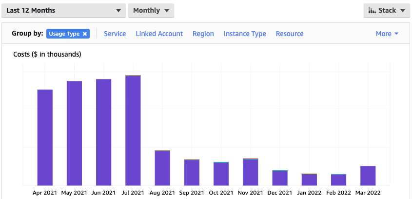
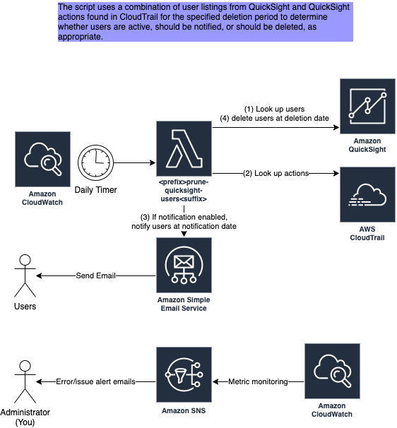
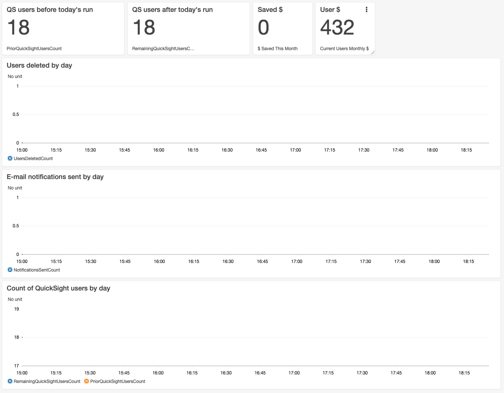

# Overview

QuickSight behaves differently than many other AWS services. When you log in to the AWS console, Your account isn't charged. Your account is only charged for usage.

Not so in the QuickSight console. When you login, you are asked for your e-mail address. Upon submitting, you create yourself as an author. Your account is charged [$24/month](https://aws.amazon.com/quicksight/pricing/) in perpetuity.

This results in a gradual upward trend in QuickSight costs. For example, here are actual costs for the past year taken from one of our AWS accounts:



In August of 2021, we implemented automatic user pruning with this Terraform module. Costs dropped precipitously. Not only that, but users were able to scale up/down as needed, and costs would adjust accordingly rather than continue to increase.

After deploying this module, you will have a Lambda that runs daily (or on a schedule of your choosing -- but keep in mind it is designed to run daily with the way notifications are designed). The Lambda compares CloudTrail events to current QuickSight users. It notifies users when they haven't been used for exactly 30 days (by default) and deletes them when they haven't been used in 45 or more days (by default). This will save you big chunks of money. No underlying resources are touched (yet). If a user makes a dashboard and that user is deleted, then it makes no difference. Other users with access still have access, and the original user may regain access by logging in again.

# Prerequisites

1. QuickSight should be enabled in the AWS account. This module provides cost-savings benefits to QuickSight and is not useful if you don't have QuickSight enabled in your account.
1. (If emails are enabled) Your account must not be in sandbox mode for SES (Simple Email Service). [Learn how to identify and remove sandbox mode here](https://docs.aws.amazon.com/ses/latest/DeveloperGuide/request-production-access.html)

# Diagram

[](docs/diagram.png)

# Consumption

## Usage Example

#### Enable Alarms and Email Users
```hcl
module "quicksight-user-pruning" {
  # Either source from Terraform Registry, or source from the github repo directly
  # source = "git::https://github.com/StateFarmIns/terraform-aws-quicksight-user-pruning.git?ref=<FIND LATEST REPO TAG>"
  # or use below 2 lines

  source  = "StateFarmIns/quicksight-user-pruning/aws"
  version = "<FIND LATEST REPO TAG>"

  # Enable email alarms for administrative users. Alerts for poor health of this module.
  monitoring_alert_email_addresses = ["admin1@example.com", "admin2@example.com"]

  # Optional block to enable email notification to users who will be deleted
  notification_config {
    ses_domain_identity_arn = "...arn..."
    contact                 = "my.contact.email@example.com"
    from                    = "from@example.com"
    reply_to                = "reply_to@example.com"
    cc                      = ["first_user_cc@example.com", "second_user_cc@example.com"]
  }
}
```

#### Bare Minimum - No alarms, no emails
```hcl
module "quicksight-user-pruning" {
  # Either source from Terraform Registry, or source from the github repo directly
  # source = "git::https://github.com/StateFarmIns/terraform-aws-quicksight-user-pruning.git?ref=<FIND LATEST REPO TAG>"
  # or use below 2 lines

  source  = "StateFarmIns/quicksight-user-pruning/aws"
  version = "<FIND LATEST REPO TAG>"
}
```

## Monitoring

If the variable `monitoring_alert_email_addresses` is passed in, the module will create an SNS topic, subscribe those email addresses, and send alarms through the topic. You must confirm the subscription in your email to begin receiving alerts.

Alarms are created for the following situations:

* \>0 Lambda errors
* \>0 Lambda throttles (i.e. account capacity is exceeded)
* 0 Lambda invocations over 24 hours
* \>0 Invalid users found. These are users whose username is `N/A`. There is a known defect in QuickSight whereby this can occur from time to time. In this case, you must delete these users manually.

Details can be found in `z-monitoring.tf`.

## Sample Dashboard

Below is the source for a sample CloudWatch Dashboard that shows the money saved by this script and the actions taken by the script.



```
{
    "widgets": [
        {
            "type": "metric",
            "x": 0,
            "y": 9,
            "width": 24,
            "height": 6,
            "properties": {
                "metrics": [
                    [ "prefix-quicksight-user-cleanup", "NotificationsSentCount" ]
                ],
                "view": "timeSeries",
                "stacked": true,
                "region": "us-east-1",
                "stat": "Sum",
                "period": 86400,
                "liveData": true,
                "legend": {
                    "position": "bottom"
                },
                "title": "E-mail notifications sent by day"
            }
        },
        {
            "type": "metric",
            "x": 0,
            "y": 3,
            "width": 24,
            "height": 6,
            "properties": {
                "metrics": [
                    [ "prefix-quicksight-user-cleanup", "UsersDeletedCount" ]
                ],
                "view": "timeSeries",
                "stacked": true,
                "region": "us-east-1",
                "stat": "Sum",
                "period": 86400,
                "title": "Users deleted by day",
                "liveData": true
            }
        },
        {
            "type": "metric",
            "x": 0,
            "y": 15,
            "width": 24,
            "height": 6,
            "properties": {
                "metrics": [
                    [ "prefix-quicksight-user-cleanup", "RemainingQuickSightUsersCount" ],
                    [ ".", "PriorQuickSightUsersCount" ]
                ],
                "view": "timeSeries",
                "stacked": false,
                "region": "us-east-1",
                "stat": "Average",
                "period": 86400,
                "liveData": true,
                "title": "Count of QuickSight users by day"
            }
        },
        {
            "type": "metric",
            "x": 6,
            "y": 0,
            "width": 6,
            "height": 3,
            "properties": {
                "metrics": [
                    [ "prefix-quicksight-user-cleanup", "RemainingQuickSightUsersCount" ]
                ],
                "view": "singleValue",
                "region": "us-east-1",
                "stat": "Maximum",
                "period": 86400,
                "title": "QS users after today's run",
                "liveData": false
            }
        },
        {
            "type": "metric",
            "x": 0,
            "y": 0,
            "width": 6,
            "height": 3,
            "properties": {
                "metrics": [
                    [ "prefix-quicksight-user-cleanup", "PriorQuickSightUsersCount" ]
                ],
                "view": "singleValue",
                "region": "us-east-1",
                "stat": "Maximum",
                "period": 86400,
                "title": "QS users before today's run"
            }
        },
        {
            "type": "metric",
            "x": 12,
            "y": 0,
            "width": 3,
            "height": 3,
            "properties": {
                "metrics": [
                    [ { "expression": "m1*24", "label": "$ Saved This Month", "id": "e1", "region": "us-east-1" } ],
                    [ "prefix-quicksight-user-cleanup", "UsersDeletedCount", { "id": "m1", "visible": false } ]
                ],
                "view": "singleValue",
                "region": "us-east-1",
                "stat": "Sum",
                "period": 2592000,
                "title": "Saved $"
            }
        },
        {
            "type": "metric",
            "x": 15,
            "y": 0,
            "width": 3,
            "height": 3,
            "properties": {
                "metrics": [
                    [ { "expression": "m1*24", "label": "Current Users Monthly $", "id": "e1", "region": "us-east-1" } ],
                    [ "prefix-quicksight-user-cleanup", "RemainingQuickSightUsersCount", { "id": "m1", "visible": false } ]
                ],
                "view": "singleValue",
                "region": "us-east-1",
                "stat": "Maximum",
                "period": 86400,
                "title": "User $"
            }
        }
    ]
}
```

Note: Change `prefix-` to your prefix.

# Contributing

Please see [./CONTRIBUTING.md](CONTRIBUTING.md).
